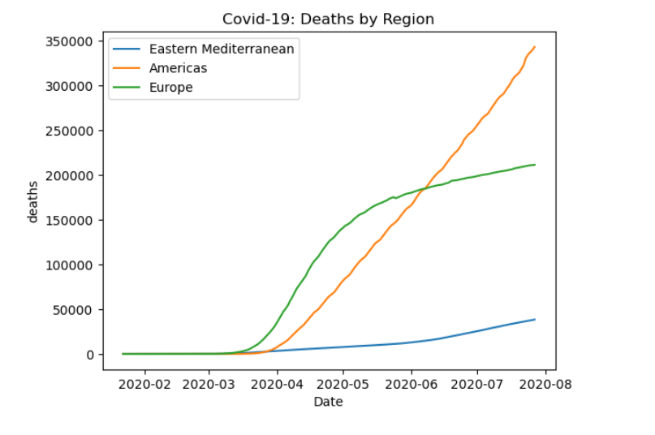
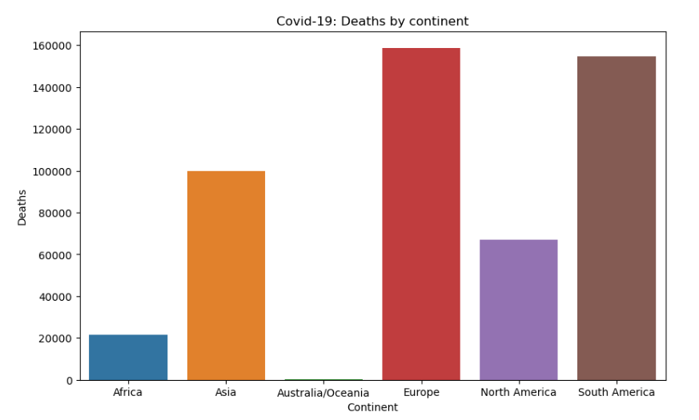
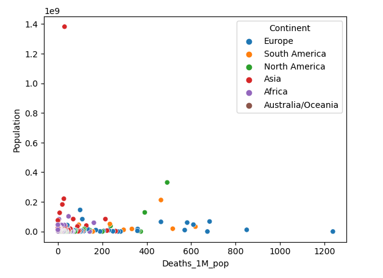
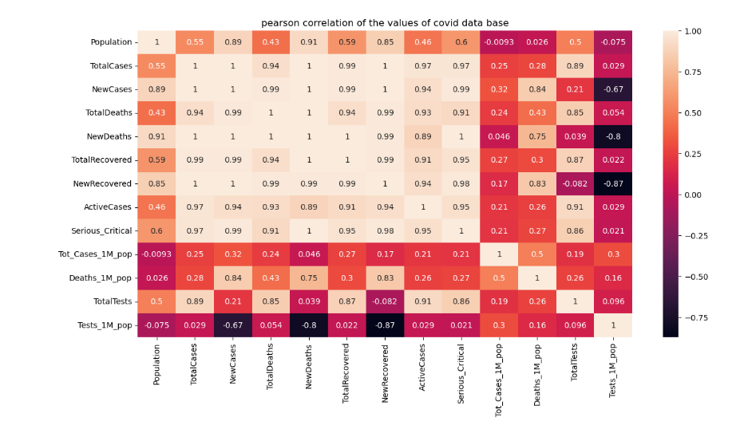

# 📊 Visualização de Dados: Impacto da COVID-19

Este repositório contém um notebook derivado de um exercicio da plataforma Kaggle em linguagem python dedicado à análise exploratória e visualização de dados sobre a pandemia de COVID-19. O objetivo é transformar datasets brutos em representações visuais claras, permitindo a identificação de padrões, picos epidemiológicos e correlações geográficas.

## 🛠️ Tecnologias e Bibliotecas

O projeto foi desenvolvido utilizando as principais ferramentas da stack de Data Science em Python:

* **Pandas:** Manipulação, limpeza e estruturação dos dados (DataFrames).
* **NumPy:** Operações matemáticas e processamento de arrays.
* **Matplotlib:** Criação de gráficos fundamentais e personalização de layouts.
* **Seaborn:** Visualizações estatísticas avançadas e design estético aprimorado.

## 📈 Funcionalidades do Notebook

1. **Tratamento de Dados:** Limpeza de registros nulos e formatação de séries temporais.
2. **Análise de Tendências:** Gráficos de linha demonstrando a evolução de casos e óbitos.
3. **Comparativo Regional:** Visualização da distribuição da doença entre diferentes países ou estados.
4. **Mapas de Calor:** Identificação de períodos de maior intensidade de contágio.

### Resultado
   * Foram gerados quatro gráficos para análise dos dados provenientes do dataset.
     ## Line Chart: Relação entre óbitos por região
     

     ## Bar Charts: Descrição dos óbitos por continente
     

     ## Scatter Plot: Relação entre tamanho da população e óbitos por milhão
     
     
     ## Heatmap de correlação: Recurso visual aplicando a correlação de pearson entre os atributos
     

